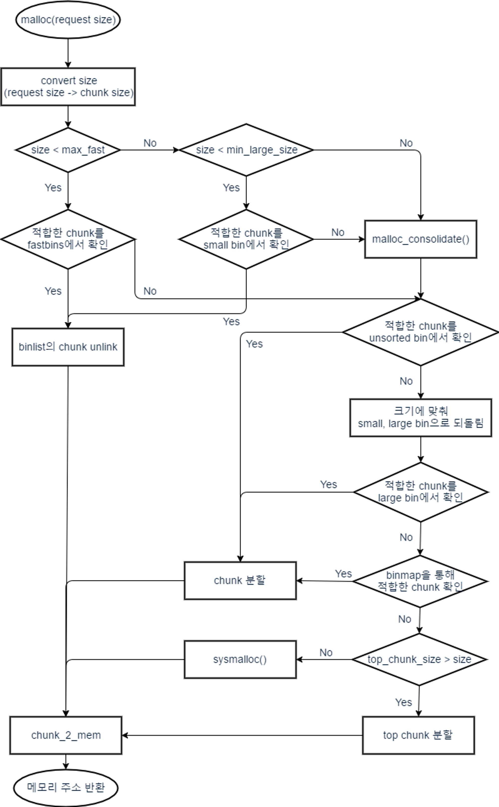
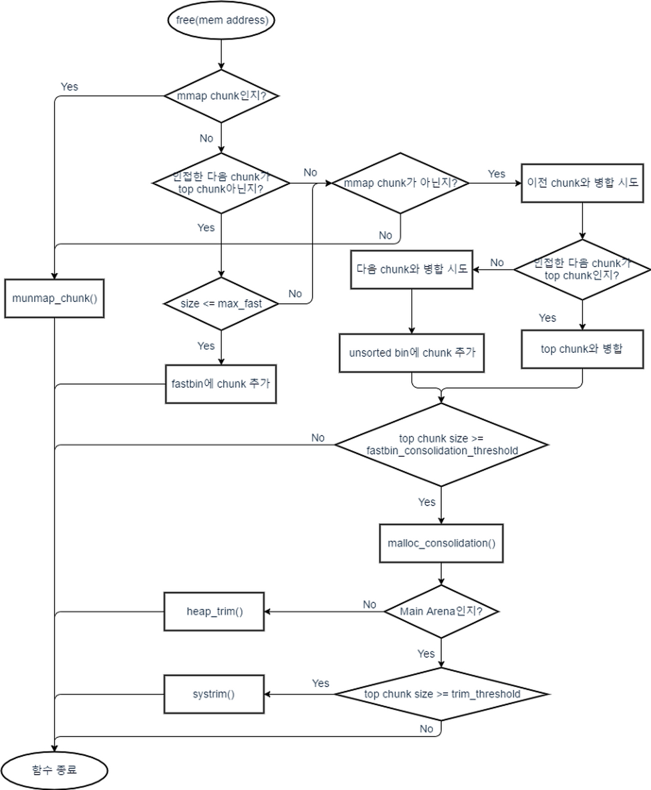

## 1. 개요

개발자가 사전에 필요한 변수와 그 크기를 아는 경우, 일반적으로 전역 변수 (초기화 된 전역변수는 .data 영역, 초기화되지 않은 전역 변수는 .bss 영역에 할당됨)나 함수 내부에서 지역 변수 (stack 영역에서 할당됨)로 선언하여 해당 변수명, 혹은 해당 변수를 가리키는 포인터를 사용하여 접근한다.

이러한 지역변수나 전역 변수의 경우, 데이터 타입에 따라 변수의 사이즈가 컴파일 시에 결정되고, 이때 선언되는 변수의 사이즈는 고정으로 변경하지 못한다.

그러나, 컴파일 시가 아닌, 런타임 시에 변수의 크기를 결정해야 되는 경우가 있다. (ex. 사용자의 입력값에 따라)

이러한 경우, 해당 데이터는 프로세스의 Heap 영역에 할당이 되고, 이러한 데이터는 일반적으로 해당 메모리 영역의 주소를 저장하고 있는 포인터 변수를 통해서 접근한다.

```c
int main(void){
    int * pData = NULL;

    pData=(int *)malloc(sizeof(int));
    *pData=5;
    printf("Data Stored in %p : %d\n",pData,*pData);
    return 0;
}
```

## 2. Heap 기초
#### 2.1 Dynamic Memory Allocator
위와 같이 Heap 영역에서의 동적으로 할당된 메모리를 관리하기 위해서 Dynamic Memory Allocator가 사용된다.

이러한 Allocator는 크게 두 가지 종류가 존재한다.
1. Explicit Allocator : 개발자가 명시적으로 공간의 할당/해제를 지시<br>
    ex)libc의 malloc, free
2. Implicit Allocator : 개발자가 공간의 할당을 지시 / free의 경우 내부적으로 처리<br>
    ex) Java의 Garbage Collection

Explicit Allocator에는 다양한 종류가 존재하나, 해당 포스팅에서는 glibc에서 사용하는 ptmalloc2에 대해서만 자세하게 다루도록 하겠다.

#### 2.2 ptmalloc2
ptmalloc2 이전의 dlmalloc의 경우, 동시에 2개 이상의 thread가 메모리 할당을 요청할 때, freelist(동적 메모리 할당을 위해서 계획적으로 사용된 데이터 구조)가 사용 가능한 thread에 둘러싸인 상태로 공유되기 때문에, race condition을 막기 위해, 한번에 한 thread만 critical section에 접근할 수 있도록 처리되었다. 따라서 이러한 dlmalloc은 multithreaded 환경에서 성능 저하가 발생했다.

ptmalloc2는 dlmalloc에 multithreaded 환경에서 효율적으로 동작하는 기능을 추가한 Allocator이다. 

ptmalloc2는 동시에 다수의 thread가 malloc을 호출할 경우, 메모리는 각각의 thread가 분배된 heap 영역을 일정하게 유지하고, 이러한 heap을 유지하기 위한 freelist 또한 분배되기 때문에, 메모리 할당이 즉시 이뤄진다. 

  - Multithreaded 환경에서 각각의 thread가 서로 간섭하지 않고 서로 다른 메모리 영역에 access 할 수 있도록 도와주는 heap 영역을 Arena라고 한다. (위에서 기술한 분배된 heap 영역을 말한다.)
  - Arena에 대한 자세한 설명은 다음 [포스팅][1]에서 기술한다.

메모리 낭비 방지, 빠른 메모리 재사용, 메모리 단편화 방지를 제공함으로써 ptmalloc는 보다 효율적인 메모리 관리를 지향한다.

##### 2.2.1 메모리 낭비 방지

메모리의 동적 할당과 해제는 매우 빈번하게 일어난다. 그러나 컴퓨터의 전체 메모리는 한정적이므로 새로운 메모리 공간을 무한히 할당할 수는 없다. 그래서 ptmalloc은 메모리 할당 요청이 발생 시, 먼저 해제된 메모리 공간 중에서 재사용할 수 있는 공간이 있는지 탐색한다.

해제된 메모리 공간 중에서 요청된 크기와 같은 크기의 메모리 공간이 있다면 이를 그대로 재사용하게 한다. 또한, 작은 크기의 할당 요청이 발생했을 때, 해제된 메모리 공간 중 매우 큰 메모리 공간이 있으면 그 영역을 나누어 주기도 한다.

##### 2.2.2 빠른 메모리 재사용

운영체제가 프로세스에게 제공해주는 가상 메모리 공간은 매우 넓다. 따라서 특정 메모리 공간을 해제한 이후에 이를 빠르게 재사용하려면 해제된 메모리 공간의 주소를 기억하고 있어야 한다. 이를 위해 ptmalloc은 메모리 공간을 해제할 때, tcache 또는 bin이라는 연결 리스트에 해제된 공간의 정보를 저장해둔다.

tcache와 bin은 여러 개가 정의되어 있으며, 각각은 서로 다른 크기의 메모리 공간들을 저장한다. (이에 대한 자세한 내용은 이후 포스팅에서 다룸) 이렇게 하면 특정 크기의 할당 요청이 발생했을 때, 그 크기와 관련된 저장소만 탐색하면 되므로 더욱 효율적으로 공간을 재사용할 수 있다.

##### 2.2.3 메모리 단편화 방지

ptmalloc은 단편화를 줄이기 위해 정렬(Alignment)과 병합(Coalescence) 그리고 분할(Split)을 사용한다. 64비트 환경에서 ptmalloc은 메모리 공간을 16바이트 단위로 할당해줍니다. 사용자가 특정 크기의 메모리 공간을 요청하면, 그보다 조금 크거나 같은 16바이트 단위의 메모리 공간을 제공한다. (16바이트 배수로 제공) 이렇게 공간을 정렬하면 16바이트 이내의 내부 단편화가 발생할 수 있지만, 외부 단편화를 감소시키는 효과가 있다.

공간을 해제하고 재사용할 때, 정확히 같은 크기의 할당 요청이 발생할 확률보다 비슷한 크기의 요청이 발생할 확률이 더 높다. 따라서 비슷한 크기의 요청에 대해서는 모두 같은 크기의 공간을 반환해야 해제된 청크들의 재사용률을 높이고, 외부 단편화도 줄일 수 있다.

ptmalloc은 특정 조건을 만족하면 해제된 공간들을 병합하기도 한다. 병합으로 생성된 큰 공간은 그 공간과 같은 크기의 요청에 의해, 또는 그보다 작은 요청에 의해 분할되어 재사용된다. 잘게 나뉜 영역을 병합하고, 필요할 때 구역을 다시 설정함으로써 해제된 공간의 재사용률을 높이고, 외부 단편화를 줄일 수 있다.

#### 2.3 함수 호출 알고리즘

아래 함수 호출 알고리즘을 공부하기에 앞서 필요한 [Arena][1]와 [chunk][2], [bins][3]에 대한 내용은 해당 줄의 링크를 통해서 확인할 수 있다. 


- **malloc 함수 호출 순서 : libc_malloc() → int_malloc() → sysmalloc()**
1. libc_malloc() 함수에서 사용하는 Thread에 맞게 Arena를 설정한 후, int_malloc() 함수 호출
2. int_malloc() 함수에서는 재사용할 수 있는 bin을 탐색하여 재할당하고, 마땅한 bin이 없다면 top chunk에서 분리해서 할당
3. top chunk가 요청한 크기보다 작은 경우, sysmalloc() 함수 호출
4. sysmalloc() 함수를 통해 시스템에 메모리를 요청해서 top chunk의 크기를 확장하고 대체
<br>※ sysmalloc() 함수는 기존의 영역을 해제한 후, 새로 할당함<br>
<center></center>

- **free 함수 호출 순서 :  libc_free() -> int_free() -> systrim() or heap_trim() or munmap_chunk()**
1. libc_free() 함수에서 mmap으로 할당된 메모리인지 확인한 후, 맞을 경우 munmap_chunk() 함수를 통해 메모리 해제
2. 아닌 경우, 해제하고자 하는 chunk가 속한 Arena의 포인터를 획득한 후, int_free() 함수 호출
3. chunk를 해제한 후, 크기에 맞는 bin을 찾아 저장하고 top chunk와 병합을 할 수 있다면 병합 수행
4. 병합된 top chunk가 너무 커서 Arena의 크기를 넘어선 경우, top chunk의 크기를 줄이기 위해 systrim() 함수 호출
5. 문제가 없다면, heap_trim() 함수 호출
6. mmap으로 할당된 chunk라면 munmap_chunk()를 호출 <br>
<center></center>


## 참고 & 출처
[**출처 1**](https://jeongzero.oopy.io/bcb0067a-3d2d-4e00-b8e7-499fba15e1bb#bcb0067a-3d2d-4e00-b8e7-499fba15e1bb)<br>
[**출처 2**](https://dreamhack.io)


[1]: /pwnable/Heap-arena/
[2]: /pwnable/Heap-chunk/
[3]: /pwnable/Heap-bins/


