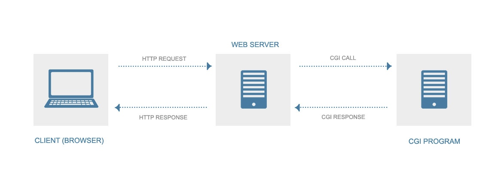

# CGI

---

CGI (Common Gateway Interface)는 웹 서버와 외부 프로그램 혹은 애플리케이션 사이에서 정보를 주고 받는 방식 또는 컨벤션을 뜻한다. 

일반적인 개념의 웹 서버(정적 웹 서버)는 client의 요청에 적합한 페이지 혹은 데이터를 응답하는 것을 목적으로 한다. 그러나 client 요청이 어떠한 계산이 필요하다거나, 데이터베이스에서 조회하는 등 매번 결과가 달라질 가능성이 있다면, 웹 서버 하나로는 이를 대처하기 어렵다.

따라서 웹 서버가 특정 프로그램과 통신하여 처리가 완료된 결과값을 받은 뒤, client에게 응답을 보낼 수 있는 인터페이스가 필요하게 되었고, CGI는 이러한 문제를 해결하기 위해 고안되었다.

**CGI는 인터페이스로서 특정 플랫폼에 의존하지 않고, 웹 서버로부터 외부 프로그램을 호출하는 방식을 정의해 놓은 것이다.** 

## FastCGI

CGI는 client로부터 들어온 요청을 처리하기 위한 데이터 처리 요청이 있을 때마다 매번 새로운 프로세스를 생성하여 처리하였다.

그러나, 이러한 방식은 요청이 늘어날 때마다 계속 fork되는 프로세스로 인해 CPU 등의 컴퓨팅 자원이 한계에 도달할 수 있다는 문제점이 존재했다.

이를 개선하기 위해, FastCGI와 같이 각각의 요청에 새로운 프로세스를 생성하는 것이 아니라 하나의 프로세스에서 여러 요청을 처리하는 방식이 도입되었다. 

CGI 방식과는 달리 FastCGI를 통해 인터페이스되는 프로세스는 웹 서버가 아닌 FastCGI 서버가 관리한다. 

FastCGI 방식을 사용하면 웹서버와 FastCGI 서버를 분리해 사용할 수 있기 때문에 가용성이 좋아진다는 장점이 존재한다. (특정 웹서버에 요청이 몰린다고 해도, 다수의 FastCGI 서버를 구성함으로써 이들을 통해 데이터 처리가 이뤄지도록 할 수 있다.)

그러나 FastCGI는 특정 프로세스가 종료되지 않고, 처리를 위해 계속 상주하고 있는 형태로 (요청이 들어오지 않는) CGI 보다는 메모리 소모가 더 크다는 단점이 있다.

이러한 FastCGI 방식 이외에도, 웹 서버에 인터프리터를 내장하는 방식으로 동작하는 mod-perl, mod-php, mod-python과 같은 방식이 존재한다. 이러한 경우 내장된 언어를 웹 서버가 해석할 수 있기 때문에, 해당 언어로 서버 프로그래밍이 가능하다. (일반적인 CGI 방식보다 더 성능이 좋다고 알려져 있다.)

# WSGI

---

WSGI (Web Server Gateway Interface)는 파이썬 웹 어플리케이션이 웹 서버와 통신하기 위한 인터페이스이다.
Django와 같은 파이썬 웹 애플리케이션 프레임워크 역시, 웹 서버와 소통할 수 있는 인터페이스를 필요로 한다. 

그러나 기존의 파이썬 웹 애플리케이션 프레임워크는 파이썬 프로그램과 상호작용 할 수 있는 인터페이스가 제한적이었기 때문에, 웹 서버를 선택하는데 있어서 제약이 존재했다. 

기존의 CGI, mod_python과 같은 경우, 몇가지 문제점이 존재했다.

- CGI - 요청마다 프로세스를 생성하기 때문에 성능과 확장성에 한계 존재
- mod_python
    - 파이썬 인터프리터는 파일을 실행할 때 캐싱을 사용한다. 따라서 파일의 내용이 바뀌면 웹 서버가 재시작 되어야 한다는 문제점이 존재했다.
    - 일반적인 Apache 웹서버의 경우 child process가 요청을 핸들링 하는데, 모든 child process가 파이썬 인터프리터 전체를 로드해야 동작이 가능했다. 이러한 것 때문에 웹 서버의 성능 저하 이슈가 발생한다.
    - mod_python이 특정 버전의 libpython에 의존적이다. 따라서 python 구버전에서 새로운 버전으로 사용하기가 어렵고, 사용하려면 mod_python을 다시 컴파일 해야 했다.

WSGI는 파이썬 웹 애플리케이션의 이와 같은 기존 인터페이스의 제한적 문제를 해결하기 위해 등장한 인터페이스이다. 

WSGI는 웹 서버의 선택과 프레임워크 선택을 분리할 수 있도록 웹 서버와 파이썬 애플리케이션 간에 표준화된 인터페이스를 정의한 것을 말한다. 

(Java Servelet API와 같이, 어떤 프레임워크 든지 어떤 웹 서버에서 동작할 수 있도록 하기 위해서)

이러한 표준대로 구현된 구현체를 WSGI 서버라고 하며, 이것은 Python App과 웹 서버 (ex, Nginx, Apache)를 연결해주는 역할을 한다. 

대표적인 WSGI 서버는 flup, gunicorn, uwsgi등이 존재한다.

## 출처 & 참고
[출처](https://show-me-the-money.tistory.com/entry/CGI와-WSGI을-파헤치다)
